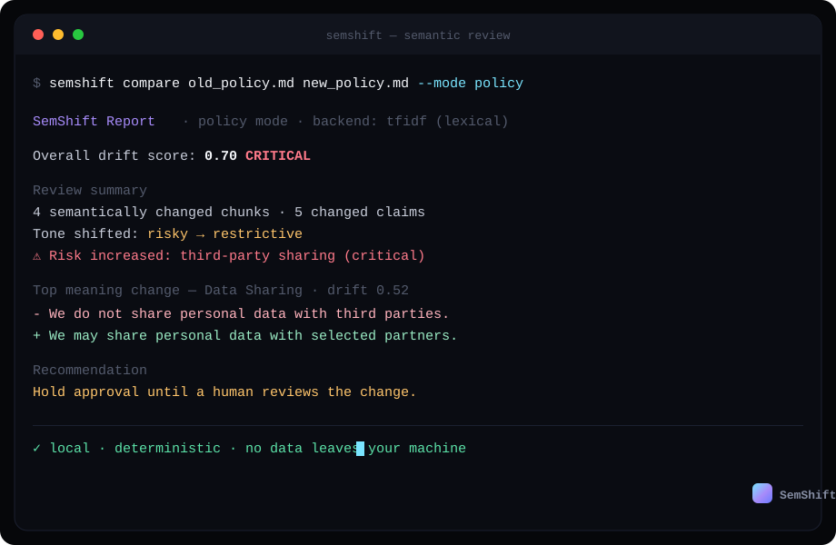
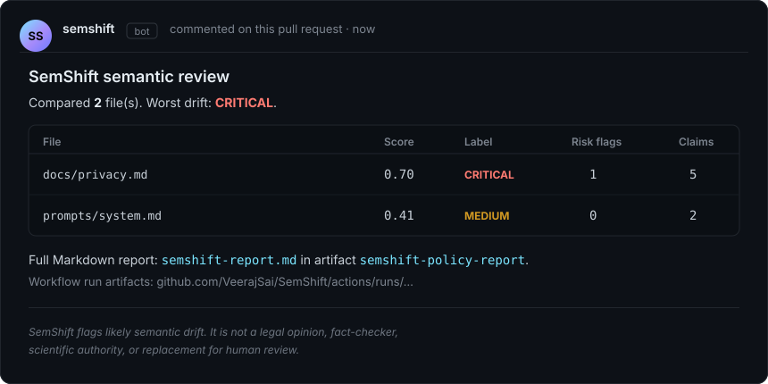

# SemShift

[](https://pypi.org/project/semshift/)
[](https://pypi.org/project/semshift/)
[](https://github.com/VeerajSai/SemShift/actions/workflows/ci.yml)
[](https://github.com/VeerajSai/SemShift/actions/workflows/security.yml)
[](LICENSE)



**SemShift reviews edited text for risky meaning changes — weakened privacy promises, softened obligations, inflated metrics, dropped safety rules — before you merge, publish, or submit. Local-first. Deterministic. No data leaves your machine.**

## 5-Second Demo

Before:

```text
We do not share personal data with third parties.
```

After:

```text
We may share personal data with trusted partners.
```

SemShift:

```text
CRITICAL: privacy commitment weakened.
Risk flag: third-party sharing.
Recommendation: hold approval until a human reviews the change.
```

Git diff shows you *what* changed. SemShift tells you *whether the meaning shifted in a way that matters*.

## 30-Second Quickstart

```bash
pip install semshift
```

Compare two files:

```bash
semshift compare examples/old_policy.md examples/new_policy.md --mode policy
```

Or review your own uncommitted edits — compare the working tree against the last commit:

```bash
semshift compare-git README.md
```

Want machine-readable output or a saved report?

```bash
semshift compare examples/old_policy.md examples/new_policy.md --mode policy --json
semshift compare examples/old_policy.md examples/new_policy.md --mode policy --report semshift-report.md
```

## Compared To

| Tool | What it catches | What it misses |
| --- | --- | --- |
| Git diff | exact text edits | risk, claims, weakened obligations |
| diff-match-patch | text similarity | domain-specific meaning changes |
| LLM judge | broad qualitative review | local determinism, reproducibility, privacy by default |
| Grammar checker | style and grammar | policy, prompt, research, and factual drift |
| SemShift | likely risky semantic drift | subtle context, truth verification, legal authority |

## GitHub Action

Gate pull requests on risky meaning changes, with an inline PR comment.



```yaml
name: SemShift Check

on:
  pull_request:
    paths:
      - "**/*.md"
      - "**/*.txt"
      - "**/*.yml"

permissions:
  contents: read
  pull-requests: write

jobs:
  semshift:
    runs-on: ubuntu-latest
    steps:
      - uses: actions/checkout@v5
        with:
          fetch-depth: 0

      - uses: VeerajSai/SemShift@v0.2.0
        with:
          mode: policy
          fail_on: high
          pr_comment: "true"
          paths: "docs/**,prompts/**,**/*.md,**/*.txt"
          exclude_paths: ".github/workflows/**"
          model: tfidf
          report: semshift-report.md
          artifact_name: semshift-policy-report
```

Inputs include `files`, `paths`, `exclude_paths`, `mode`, `fail_on`, `model`, `report`, `artifact_name`, `base_ref`, `pr_comment`, `github_token`, `max_file_size`, and `max_chunks`.

> **Note:** `fail_on` defaults to `high`. Use `fail_on: none` for warn-only mode.

## Modes

Six review modes tune the risk rules to your document type: `policy`, `prompt`, `research`, `resume`, `readme`, and `default`. Pick one with `--mode`.

| Mode | Best for |
| --- | --- |
| `policy` | privacy policies, terms, consent language |
| `prompt` | system prompts and instruction files |
| `research` | research drafts and reports |
| `resume` | resumes and bios |
| `readme` | README and support docs |
| `default` | general text review |

See [docs/use-cases.md](docs/use-cases.md) for worked examples of each mode.

## Install

```bash
pip install semshift
```

Optional local embedding backend (SentenceTransformers, runs on your machine):

```bash
pip install "semshift[models]"
```

Optional PDF and DOCX support:

```bash
pip install "semshift[formats]"
```

Development:

```bash
pip install -e ".[dev]"
```

Supported file formats: `txt`, `md`, `rst`, `json`, `yaml`, `yml`, `py`, `js`, `ts` out of the box, plus `pdf` and `docx` with `semshift[formats]`.

For large or generated files, cap the work:

```bash
semshift compare old.md new.md --max-file-size 5242880 --max-chunks 2000
```

## Python API

```python
from semshift import compare_files, compare_text

result = compare_text(
    old="We do not share personal data.",
    new="We may share personal data with partners.",
    mode="policy",
)

print(result.drift_label)
print(result.summary)
print(result.risk_flags)
print(result.to_markdown())

file_result = compare_files("old_policy.md", "new_policy.md", mode="policy")
report = file_result.to_markdown()
```

Result fields include `drift_label`, `overall_score`, `drift_score`, `summary`, `matched_chunks`, `chunk_matches`, `claim_changes`, `tone_shift`, `risk_flags`, `warnings`, `metadata`, plus `to_dict()`, `to_json()`, and `to_markdown()`.

## How It Works

SemShift combines transparent, inspectable signals — no black-box model decides for you:

1. Chunk alignment by headings and text structure.
2. Lexical TF-IDF similarity by default, or optional local SentenceTransformers embeddings.
3. Claim extraction, tone signals, and mode-specific risk rules.

TF-IDF is a **lexical** backend, not a true semantic model. Optional embedding models may download weights on first use; document text is processed locally unless you explicitly integrate external services.

## Benchmarks

SemShift ships a starter self-evaluation benchmark for regression tracking. See [docs/benchmarks.md](docs/benchmarks.md).

These numbers are self-evaluation, **not** independent validation. They are useful for catching regressions, not for scientific claims — human-labeled outside evaluation is still needed.

## Honesty Is a Feature

SemShift is deliberately upfront about what it is and is not. Trust comes from clear limits:

- not legal advice
- not a fact-checker
- not scientific authority
- not a replacement for human review
- likely to miss subtle context-dependent changes
- likely to false-positive on harmless paraphrases
- lexical + heuristic by default

SemShift flags changes worth a human's attention. The human still decides.

## Troubleshooting

`semshift: command not found`: Confirm the active environment is the one where you installed `semshift`.

Model import error: Install optional dependencies with `pip install "semshift[models]"`, or use `--model tfidf`.

Slow first model run: SentenceTransformers may download weights and initialize on first use.

Windows path issues: Quote paths with spaces and prefer PowerShell-compatible quoting.

GitHub Action fork PRs: PR comments can be unavailable for forks with restricted permissions; the report artifact is still written.

No files matched: Pass `files` or `paths`, use `actions/checkout@v5` with `fetch-depth: 0`, or check supported extensions. Use `exclude_paths` for generated files or workflow YAML.

Report too long: GitHub comments are truncated and link to the workflow run where the configured report artifact is uploaded.

## Roadmap

- stronger external benchmark
- NLI-based deep mode for contradiction/entailment checks
- VS Code extension
- web demo
- docs site
- more file formats

## Author

Built by Veeraj Sai.

## Citation

Please cite SemShift using [CITATION.cff](CITATION.cff).

## License

MIT. See [LICENSE](LICENSE).

## Security

Report vulnerabilities through [GitHub Security Advisories](https://github.com/VeerajSai/SemShift/security/advisories/new). SemShift is local-first by default, but optional model downloads and external CI integrations should be reviewed in your environment.
