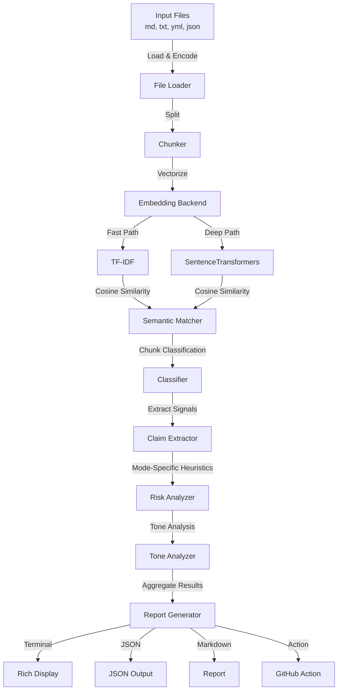

# SemShift

[](https://github.com/VeerajSai/semshift/actions/workflows/ci.yml) [](https://www.python.org/) [](LICENSE) [](https://pypi.org/project/semshift/) [](#cli-usage)

**Git diff for meaning.** Detect semantic drift, claim changes, tone shifts, and risk changes in text files, documentation, policies, prompts, research drafts, resumes, and LLM outputs.

*Semantic diff: Local-first • Open-source • Designed for review workflows*

---

## The Problem

Git diff tells you what *words* changed. SemShift tells you what *meaning* changed.

Most review tools are literal. They show that a sentence changed, but not whether the promise, risk, obligation, or factual claim changed. That gap matters:

- **Privacy policy**: Changes from `We do not share personal data` → `We may share personal data with selected partners`
- **README**: Removes `experimental` and adds `guaranteed accurate`
- **Prompt**: Loses a safety rule, gains a hidden instruction
- **Resume**: Rewrite turns `18% latency reduction` → `45% latency reduction`
- **Research**: Dataset, baseline, metric, and conclusion all change

SemShift gives reviewers a fast local signal for the parts worth reading carefully.

### Demo: What SemShift Flags

Compare a privacy policy change:

```
Old: We do not share personal data with third parties.
New: We may share personal data with selected partners.
```

Run:
```bash
semshift compare-text \
  "We do not share personal data with third parties." \
  "We may share personal data with selected partners." \
  --mode policy
```

SemShift flags:
- **CRITICAL semantic drift** (0.89)
- **Drift summary**: Permission shifted from explicit non-sharing to conditional sharing
- **Risk flags**: CRITICAL third-party sharing, HIGH reduced consent
- **Why it matters**: Dispute resolution rights and liability changed significantly

---

## Installation

### Basic Installation (CLI with TF-IDF)

For fast, deterministic local analysis without downloading ML models:

```bash
pip install semshift
```

This installs SemShift and all core dependencies. The default embedding backend is TF-IDF, which works instantly and offline.

### With Sentence Transformers (Optional)

For deeper semantic embeddings using sentence transformers:

```bash
pip install "semshift[models]"
```

This adds `sentence-transformers` and enables you to use:
```bash
semshift compare old.md new.md --model sentence-transformers/all-MiniLM-L6-v2
```

### Development Installation

```bash
git clone https://github.com/VeerajSai/semshift.git
cd semshift
pip install -e ".[dev]"
pytest
```

---

## Quick Start

### CLI

Compare two files:
```bash
semshift compare old_policy.md new_policy.md --mode policy
```

Compare raw text:
```bash
semshift compare-text "old text" "new text"
```

With a specific embedding model:
```bash
semshift compare old.md new.md --model tfidf  # Fast, offline (default)
```

Get structured JSON output:
```bash
semshift compare old.md new.md --json
```

Generate a markdown report:
```bash
semshift compare old.md new.md --report drift-report.md --top 10
```

Fail CI if drift is too high:
```bash
semshift compare old.md new.md --fail-on critical
```

List all available modes:
```bash
semshift modes
```

### Python API

```python
from semshift import compare_files, compare_text

# Compare files
result = compare_files("old_policy.md", "new_policy.md", mode="policy")
print(f"Drift: {result.drift_label}")
print(f"Score: {result.overall_score}")

# Compare text
result = compare_text(
    old="We do not share personal data.",
    new="We may share personal data with partners.",
    mode="policy",
)

# Inspect results
for flag in result.risk_flags:
    print(f"{flag.severity}: {flag.category} - {flag.why}")

for claim in result.claim_changes:
    print(f"Changed: {claim}")
```

---

## Features

SemShift detects:

- **Meaning changes**: Added, removed, and semantically changed chunks
- **Specific entities**: Numbers, percentages, dates, metrics, modal verbs, strong claim phrases
- **Domain-specific terms**:
  - Policy/legal: Data sharing, retention, consent, tracking, liability, arbitration, obligations, rights
  - Prompt: Safety rules, hidden instructions, constraints, output format, scope changes
  - Research: Metrics, datasets, baselines, limitations, conclusions, uncertainty wording
  - Resume: Role titles, impact metrics, tools, company/project names, inflated claims
  - README: Install steps, feature claims, limitations, platforms, requirements, pricing, commercial wording
- **Tone shifts**: Cautious → confident, neutral → restrictive, etc.
- **Risk changes**: Automatically flags critical shifts with severity levels

---

## Modes

| Mode | Use case | Review focus |
| --- | --- | --- |
| `default` | General semantic comparison | Generic meaning drift |
| `policy` | Privacy policies, terms of service | Data sharing, consent, liability, retention |
| `readme` | README, installation docs | Features, limitations, supported platforms |
| `research` | Research papers, study reports | Metrics, datasets, baselines, conclusions |
| `resume` | Resume, CV | Role claims, impact metrics, company names |
| `prompt` | System prompts, instructions | Safety rules, hidden instructions, scope, format |

---

## CLI Usage

```bash
# Basic comparison
semshift compare old.md new.md

# With specific mode
semshift compare old.md new.md --mode policy

# Change embedding backend
semshift compare old.md new.md --model tfidf          # Fast, offline (default)
semshift compare old.md new.md --model sentence-transformers/all-MiniLM-L6-v2  # Deeper (requires pip install "semshift[models]")

# Output formats
semshift compare old.md new.md --json                 # Machine-readable
semshift compare old.md new.md --report report.md     # Markdown report

# CI/CD integration
semshift compare old.md new.md --fail-on high         # Exit with code 1 if drift >= high
semshift compare old.md new.md --top 3                # Show only top 3 changes

# Compare raw text
semshift compare-text "old text" "new text" --mode policy

# Utility
semshift modes  # List all available modes
```

---

## Examples

### Policy Comparison

```bash
semshift compare examples/old_policy.md examples/new_policy.md \
  --mode policy \
  --model tfidf \
  --top 3
```

Output:
```
SemShift Report
examples/old_policy.md -> examples/new_policy.md
Mode: policy | Backend: tfidf

Overall semantic drift: 0.71 CRITICAL

Review Summary
- 4 semantically changed chunks
- 5 changed claims
- Risk increased: third-party sharing (critical)

Top Meaning Changes
1. Liability (Drift: 0.80)
   Old: "We make reasonable efforts to protect user data."
   New: "We disclaim liability for indirect damages."
   Why: Liability shifted to users.

Risk Flags
- CRITICAL third-party sharing
- HIGH longer retention
- HIGH reduced consent
```

See [examples/sample_policy_report.md](examples/sample_policy_report.md) for a full markdown report example.

### More Examples

```bash
# Terms of Service
semshift compare examples/old_terms.md examples/new_terms.md --mode policy --model tfidf

# Prompts
semshift compare examples/old_prompt.txt examples/new_prompt.txt --mode prompt --model tfidf

# Resume
semshift compare examples/old_resume.md examples/new_resume.md --mode resume --model tfidf

# Research
semshift compare examples/old_research.md examples/new_research.md --mode research --model tfidf

# README
semshift compare examples/old_readme.md examples/new_readme.md --mode readme --model tfidf
```

---

## GitHub Action

Automatically check semantic drift in pull requests. Copy and customize:

### Basic Setup

```yaml
name: SemShift Check

on:
  pull_request:
    paths:
      - "**/*.md"
      - "**/*.txt"
      - "**/*.yml"

permissions:
  contents: read
  pull-requests: write

jobs:
  semshift:
    runs-on: ubuntu-latest
    steps:
      - uses: actions/checkout@v4
        with:
          fetch-depth: 0

      - uses: VeerajSai/semshift@v1
        with:
          mode: "policy"
          fail_on: "critical"
          pr_comment: "true"
```

### Advanced Setup (Specific Files)

```yaml
- uses: VeerajSai/semshift@v1
  with:
    files: "docs/PRIVACY.md,README.md,system_prompts/*.txt"
    mode: "policy"
    fail_on: "high"
    pr_comment: "true"
    report: "drift-analysis.md"
```

### Action Inputs

| Input | Required | Default | Description |
| --- | --- | --- | --- |
| `files` | No | *auto-detect* | Comma-separated files or globs. Leave empty to auto-detect changed files. |
| `mode` | No | `default` | Review mode: default, policy, readme, research, resume, or prompt |
| `fail_on` | No | `high` | Fail when drift reaches: low, medium, high, critical |
| `model` | No | `tfidf` | Embedding backend: tfidf (fast) or sentence-transformers model name |
| `report` | No | `semshift-report.md` | Path to write markdown report artifact |
| `pr_comment` | No | `false` | Post or update a PR comment with summary |

### Action Outputs

| Output | Description |
| --- | --- |
| `report_path` | Path to the generated markdown report |
| `worst_label` | Worst drift label found: low, medium, high, or critical |

The action uploads a markdown report artifact and can optionally post a PR comment summarizing the drift findings.

---

## Python API

### `compare_files()`

```python
from semshift import compare_files

result = compare_files(
    old_path="old_policy.md",
    new_path="new_policy.md",
    mode="policy",  # Optional: default, policy, readme, research, resume, prompt
    model="tfidf",  # Optional: tfidf (default) or sentence-transformers model
)

# Inspect result
print(result.overall_score)         # 0.0 - 1.0
print(result.drift_label)            # low, medium, high, critical
print(result.summary)                # Human-readable summary
print(result.chunk_matches)          # List of matched chunks
print(result.claim_changes)          # List of detected claim changes
print(result.tone_shift)             # Tone analysis
print(result.risk_flags)             # List of risk flags
```

### `compare_text()`

```python
from semshift import compare_text

result = compare_text(
    old="We do not share personal data.",
    new="We may share personal data with partners.",
    mode="policy",
)

for flag in result.risk_flags:
    print(f"{flag.severity}: {flag.category} - {flag.why}")
```

### Result Object

```python
result.overall_score       # float: 0.0-1.0 drift magnitude
result.drift_label         # str: low, medium, high, critical
result.summary             # str: human-readable summary
result.chunk_matches       # list: matched old->new chunks with similarity
result.claim_changes       # list: detected specific claim changes
result.tone_shift          # str: detected tone change or None
result.risk_flags          # list: RiskFlag objects with severity, category, why
result.recommendations     # list: actionable next steps
result.embedding_backend   # str: tfidf, sentence-transformers/..., etc.
result.warnings            # list: any warnings (e.g., fallback used)
```

---

## JSON Output

Use `--json` for machine-readable output:

```bash
semshift compare old.md new.md --json
```

Returns a JSON object with:
- `files`: Input file paths
- `mode`: Review mode used
- `overall_score`: Numeric drift (0.0-1.0)
- `drift_label`: Categorical label (low, medium, high, critical)
- `summary`: Human-readable summary
- `chunk_matches`: List of matched chunks
- `claim_changes`: List of claim changes
- `tone_shift`: Tone analysis result
- `risk_flags`: List of flagged risks with severity
- `recommendations`: Actionable next steps
- `embedding_backend`: Backend used (tfidf, etc.)
- `warnings`: Any warnings or fallback notices

---

## How It Works

1. **Load**: Read supported text files with encoding fallback
2. **Chunk**: Split text into reviewable chunks, preserving headings and line ranges
3. **Embed**: Generate embeddings with TF-IDF (default, fast) or SentenceTransformers (optional, deeper)
4. **Align**: Match old chunks to new chunks using cosine similarity and heading-aware alignment
5. **Classify**: Label chunks as unchanged, lightly changed, semantically changed, removed, or added
6. **Extract**: Identify high-signal claims (numbers, dates, modals, strong phrases, policy terms)
7. **Risk Analysis**: Apply tone and mode-specific risk heuristics
8. **Report**: Generate Rich terminal output, JSON, markdown reports, or GitHub Action summaries

---

## Architecture

SemShift processes semantic drift detection through a unified pipeline:



**Key Pipeline Features**
- Dual embedding backends: Fast TF-IDF (default) or deep SentenceTransformers (optional)
- Heading-aware chunk alignment for logical comparison
- Mode-specific risk heuristics for policy, research, resume, prompt, and readme contexts
- Multiple output formats for terminal, CI/CD, and report generation
- Deterministic local processing with no external API calls

---

## Demo & Assets

### Visualizing SemShift

We provide demo files in the `examples/` directory to test SemShift:

```bash
# Run a quick demo
semshift compare examples/old_policy.md examples/new_policy.md --mode policy --model tfidf
```

### Adding a Demo GIF

To showcase SemShift in action, add a demo GIF to the repository:

1. **Record a demo**: Capture terminal output showing `semshift compare` command with rich formatting
2. **Save to assets**: Place the GIF file in `assets/demo.gif`
3. **Update README**: Embed the GIF with:
   ```markdown
   
   ```

**Asset Guidelines**:
- Place demo GIFs and screenshots in `assets/` folder
- Use descriptive filenames: `demo.gif`, `policy-example.png`, etc.
- Optimize GIF/PNG size for web (< 5MB recommended)
- Include alt text in markdown for accessibility

---

## What SemShift Is Not

- Not a legal opinion
- Not a fact-checker
- Not a replacement for human review
- Not a proof that meaning did or did not change
- Not dependent on a paid LLM API
- Not a plagiarism detector or paraphrasing tool

**SemShift is a review assistant.** It finds likely semantic drift and explains why a human should inspect it.

---

## Supported File Types

- `.md`, `.rst` (Markdown / reStructuredText)
- `.txt` (Plain text)
- `.yml`, `.yaml` (YAML)
- `.json` (JSON)
- `.py`, `.js`, `.ts` (Source code)

---

## Development

### Setup

```bash
git clone https://github.com/VeerajSai/semshift.git
cd semshift
pip install -e ".[dev]"
```

### Run Tests

```bash
pytest                    # Run all tests
pytest -v                 # Verbose output
pytest tests/test_cli.py  # Run specific test file
```

### Code Quality

```bash
ruff check .              # Lint
ruff format .             # Format
```

### Guidelines for Contributors

See [CONTRIBUTING.md](CONTRIBUTING.md) for:
- How to add a new mode
- How to improve heuristics
- Review workflow guidelines
- Pull request checklist

---

## Contributing

Thanks for helping make SemShift sharper! We welcome:

- Real-world examples where word diff misses semantic drift
- Improved chunking or matching while preserving explainability
- Mode-specific risk heuristics with tests
- CLI, markdown, or GitHub Action UX improvements
- Bug reports and edge case fixes

See [CONTRIBUTING.md](CONTRIBUTING.md) for details.

---

## License

[MIT](LICENSE)

---

## Security

For security issues, please report privately through [GitHub Security Advisories](https://github.com/VeerajSai/semshift/security/advisories/new).

See [SECURITY.md](SECURITY.md) for the full security policy.

---

## Community

- [Issues](https://github.com/VeerajSai/semshift/issues) - Report bugs or request features
- [Discussions](https://github.com/VeerajSai/semshift/discussions) - Ask questions or share ideas
- [Changelog](CHANGELOG.md) - See what's new in each release

---

## Acknowledgments

SemShift builds on semantic similarity research and practical experience reviewing documentation, policies, and prompts at scale.

Built for reviewers, maintainers, and teams that care about meaning.
